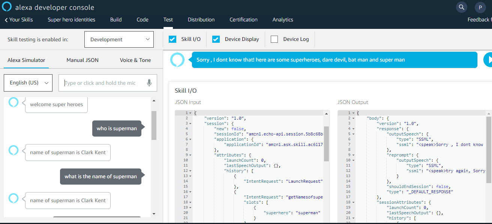

# group-7-alexa

## Group Members
  - Priyanka Bodapati
  - Tyler Jacobson
  - Kelsie Dibben
  - Ashley Stanbridge

## Github Profiles
  - [Tyler's Profile](https://github.com/tjac1336)
  - [Priyanka's Profile](https://github.com/pinky407)
  - [Ashley's Profile](https://github.com/AshleyStanbridge96)
  - [Kelsie's Profile](https://github.com/kdibben)

  [Alexa Course](https://developer.amazon.com/en-US/alexa/alexa-skills-kit)
  
  - Add PowerPoint slides

 ## Steps to Build an Alexa App
 1. Open [Alexa Developer Console](https://developer.amazon.com/alexa/console/ask)
 2. Click 'Create a skill' and name your skill
 3. Select 'Start from scratch'
 4. Add and name an intent (intent's are similar to functions)
    a. Add keywords and sentances for Alexa to recognize. Ex: "Who is {superhero}"
 5. Create a slot type
    a. Add accepted values for the keywords (word enclosed in curly braces). Ex: batman, superman, antman, ect.
 6. Go to intent 
    a. Scroll down and assign your {keyword} to a slot type
 7. Save
 8. Build model
 9. Select JSON file on left and copy it
 10. Go to [Alexa Code Generator](https://s3.amazonaws.com/webappvui/skillcode/v2/index.html)
 11. Paste JSON code into the converter, select both checkboxes, and generate the code
 12. Copy the generated code
 13. Open [Lambda Console](https://console.aws.amazon.com/console/)
 14. Select 'Services' at the top
 15. Click on 'Lambda'
 16. Click 'Create Function'
 17. Browse serverless app repository
 18. Scroll down, click on 'alexa-skills-kit-node.js-factskill'
 19. Scroll down, name application
 20. Select top resource
 21. Replace code with code generated from the code generator into file
 22. Copy ARN at the top of the page
 23. Go back to Developer console 
 24. Scroll down and select 'Endpoint' on the left
     a. Click AWS Lambda ARN
     b. Paste into 'Default Region'
 25. Save Endpoint
 26. Click 'Test' at the top
 27. Enable testing in development
 28. Edit code so Alexa interacts and responds as you please
 29. Make sure you tell Alexa to "open 'appname'" before testing, otherwise you will not be testing your skill
 
 ## Output of Superheroes
 -
